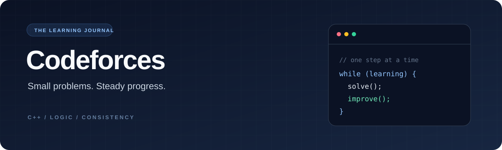

<div align="center">



# Codeforces Problems

**One problem at a time. One concept at a time.**

My personal collection of Codeforces solutions in C++, documenting the problems I solve and the ideas I learn along the way.


[Browse solutions](#-problem-index) · [Run locally](#-run-a-solution) · [GitHub profile](https://github.com/Uttkarshchambiyal)

</div>

---

## 📚 Problem index

Each entry links to the original problem and my source code.

| ID | Problem | Concepts practiced | My solution |
| :--- | :--- | :--- | :---: |
| **50A** | [Domino Piling](https://codeforces.com/problemset/problem/50/A) | Arithmetic, integer division | [C++ ↗](A_Domino_piling.cpp) |
| **112A** | [Petya and Strings](https://codeforces.com/problemset/problem/112/A) | Strings, case conversion, lexicographic comparison | [C++ ↗](A_Petya_and_Strings.cpp) |
| **236A** | [Boy or Girl](https://codeforces.com/problemset/problem/236/A) | Strings, sets, distinct characters, parity | [C++ ↗](A_Boy_or_Girl.cpp) |
| **263A** | [Beautiful Matrix](https://codeforces.com/problemset/problem/263/A) | Matrices, Manhattan distance | [C++ ↗](A_Beautiful_Matrix.cpp) |
| **977A** | [Wrong Subtraction](https://codeforces.com/problemset/problem/977/A) | Simulation, loops, last-digit operations | [C++ ↗](A_Wrong_Subtraction.cpp) |

## 💡 Ideas behind the solutions

- **Domino Piling:** Each domino covers two cells, so the maximum count is the board area divided by two, rounded down.
- **Petya and Strings:** Convert both strings to lowercase, then compare characters until the first difference.
- **Boy or Girl:** Count distinct characters using a set, then choose the output based on whether that count is even or odd.
- **Beautiful Matrix:** Find the `1` and add its horizontal and vertical distances from the center.
- **Wrong Subtraction:** Repeat the operation: remove a trailing zero by dividing by ten; otherwise subtract one.

## 🚀 Run a solution

You need Git and a C++ compiler with C++17 support, such as GCC or Clang.

```bash
git clone https://github.com/Uttkarshchambiyal/codeforces-problems.git
cd codeforces-problems
```

Compile and run any solution independently:

```bash
g++ -std=c++17 -O2 A_Domino_piling.cpp -o solution
./solution
```

For example, enter `3 3` to get `4`. You can also pipe input directly:

```bash
printf '3 3\n' | ./solution
```

Every `.cpp` file has its own `main()` and reads from standard input. Compile one file at a time.

## 🌱 About this journal

I'm using this repository to build consistency in competitive programming, strengthen my C++ fundamentals, and make my progress easy to explore. New solutions will be added as I solve more problems.

The index reflects the source files in this repository. All five solutions were compiled with C++17 and passed their saved sample cases locally. Codeforces submission verdicts are not tracked here.

<div align="center">

---

**Solve · Learn · Repeat**

Built with curiosity by [Uttkarsh](https://github.com/Uttkarshchambiyal)

</div>
